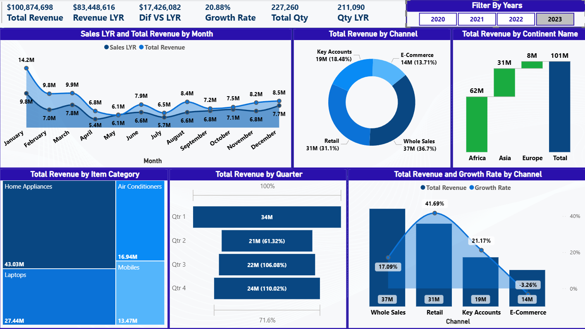

# YoY Sales Growth & Performance Dashboard (Power BI)

This project is an interactive Power BI dashboard built to analyze
year-over-year sales growth, channel performance, and business trends
for the period 2020–2023.

The dashboard focuses on comparing current performance against last year
to identify growth drivers, weak areas, and seasonality patterns.

## What this dashboard analyzes
- Revenue vs Last Year (YoY)
- Growth Rate %
- Monthly trends (Current Year vs Last Year)
- Quarterly performance
- Sales channel contribution
- Channel growth and decline
- Product category mix
- Geographic revenue distribution

## Business Questions
- Which sales channels are driving growth?
- Which channels are declining?
- How does this year perform compared to last year?
- Which quarters and months generate the most revenue?
- Where is revenue concentration increasing or decreasing?

## Tools & Techniques
- Power BI
- DAX (YoY, LY, Growth %, time intelligence)
- Data modeling
- Interactive filters & slicers

## Files
- yoy-sales-growth-dashboard.pbix → Power BI dashboard
- overview.png → Dashboard preview

This project demonstrates how performance and growth analysis can be implemented in Power BI using time-based metrics and dynamic filtering.
